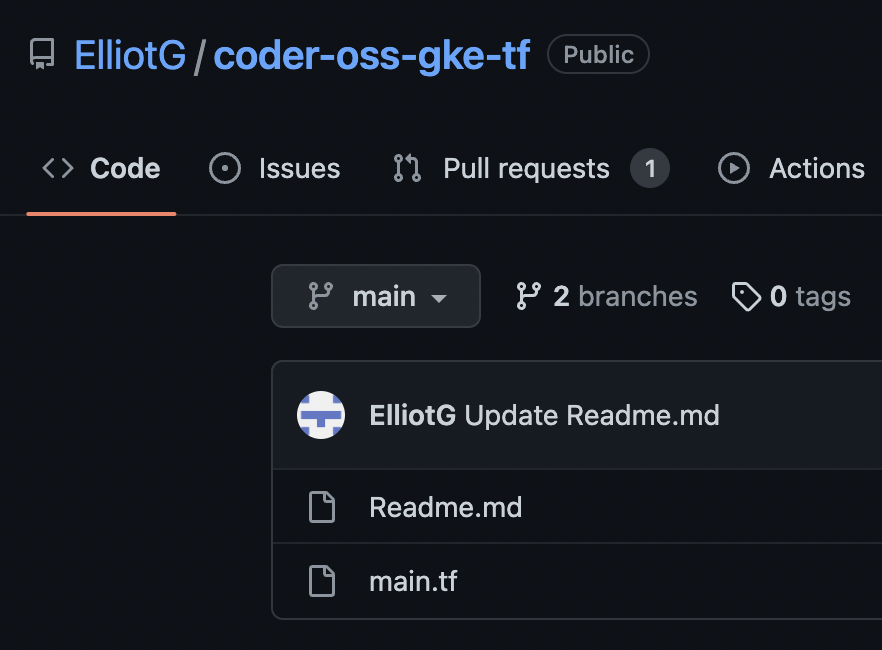

# Coder OSS on GKE with Terraform and Spacelift in <20 minutes

From Repo

To fully remote VS code in <20 minutes. Let's go!

The purpose of this repo is to get you exploring how Coder works in the quickest time possible. This repo assumes you have full access to the underlying account / project, and it is a very good fit for using your personal email address. The idea is for you to check out what a fully remote dev environment looks/feels like, before committing to a deeper investigation.

## Get Google Cloud Set Up

1. Enable the Compute, Network, and Kubernetes APIs
2. Create a project (and delete the default VPC network)
3. Go to IAM & Admin / Service Accounts, and hit Create Service Account
4. Give it admin (you should downgrade this later)
5. Generate a Key as a JSON object and run `cat key.json | tr -s '\n' ' '` and save this.

## Getting the repo set up

1. Fork this repo and set up your IaC in Spacelift (any IaC platform will do)
2. Follow their [instructions](https://docs.spacelift.io/integrations/source-control/github#setting-up-the-integration) to get your repo triggering Terraform builds
4. Set the following values

GOOGLE_CREDENTIALS: <the value saved from step 6>
TF_VAR_project:     <the GCP project from step 2>

At this point, the project should plan correctly.

## Getting Coder-OSS Installed

1. Apply the repo
2. Head to the Google Cloud Console / Kubernetes Engine / Service & Ingress
3. Copy the URL from the Coder external load balancer
4. Replace the CODER_ACCESS_URL with that IP address (FIXME)
5. Reapply the repo

## Getting Coder-OSS Configured

1. Head over to the same CODER_ACCESS_URL from above
2. The app should prompt you to create the initial user/credentials
3. Go to Templates / Kubernetes / Create Workspace and give it a name
4. After <5 minutes, you should now have a working Workspace.
