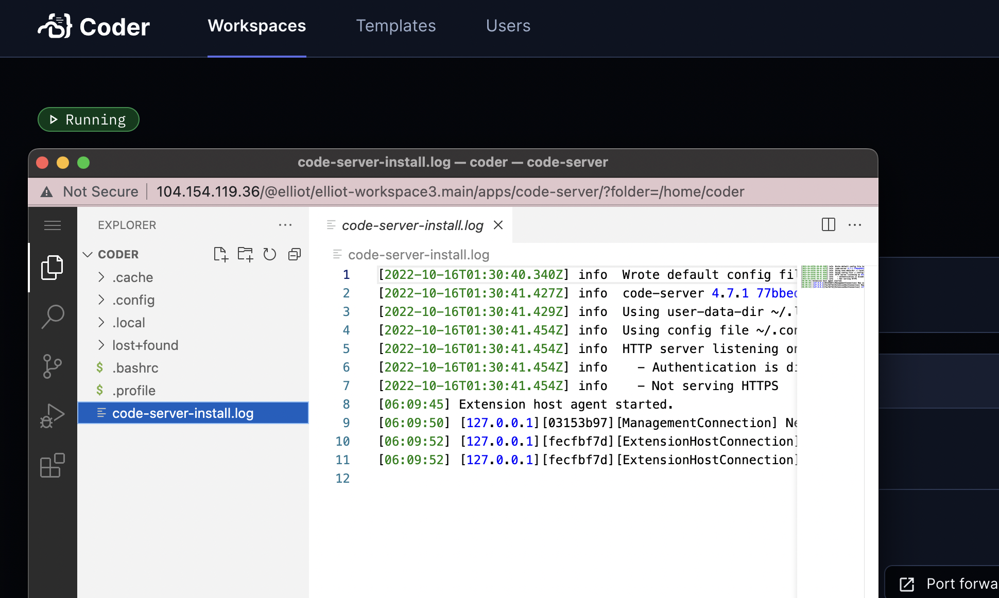

# Coder OSS with Terraform

The purpose of this repo is to demonstrate how remote development environments work using [Coder's OSS product](https://github.com/coder/coder). This repo should not be used for production use cases, but simply a proof-of-concept for what coding-in-a-browser feels like using Coder.

## Currently supported platforms

Each subfolder in this repo is for a different platform.

* Google GKE 
* Azure AKS
* AWS EKS
* DigitalOcean DOKS
* IBMCloud K8s
* OVHCloud K8s
* Scaleway K8s Kapsule
